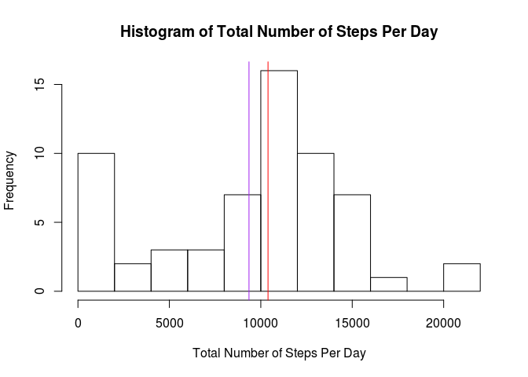
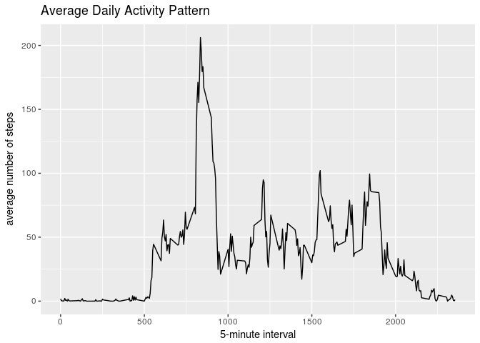
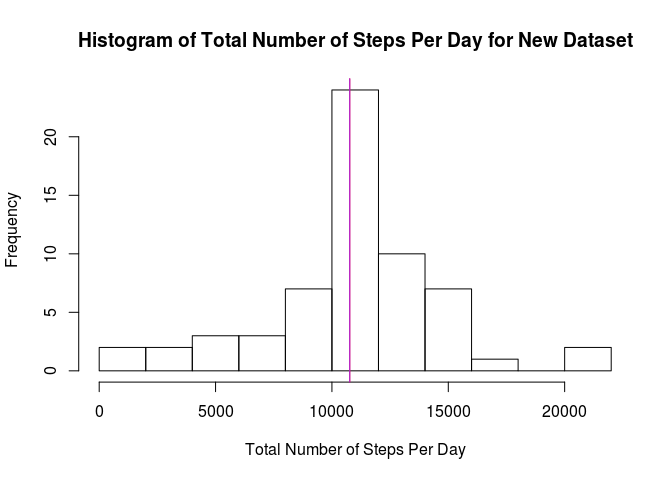
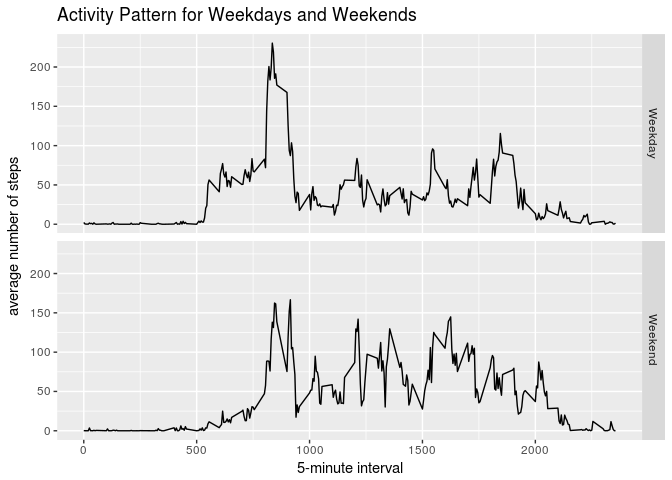

# Reproducible Research: Peer Assessment 1
Tuoling Qiu  
`r Sys.Date()`  


## Loading and preprocessing the data

```r
## Check for whether the dataset exists, if not, download and unzip it.
if (!file.exists("activity.csv")) {
    fileUrl <- "https://d396qusza40orc.cloudfront.net/repdata%2Fdata%2Factivity.zip"
    download.file(fileUrl, destfile = "activity.zip", method="curl")
    unzip(zipfile = "activity.zip")
}

## Load the data
activity <- read.csv("activity.csv")

## Change the date column from factor to date format
activity$date <- as.Date(as.character(activity$date), "%Y-%m-%d")
```


## What is mean total number of steps taken per day?

```r
## Calculate total number of steps taken per day
total_step <- with(activity, tapply(steps, date, sum, na.rm=T))

## Make a histogram of the total number of steps per day
hist(total_step, breaks=10, main="Histogram of Total Number of Steps Per Day",
     xlab="Total Number of Steps Per Day")

## Calculate and report the mean and median 
mean_step = mean(total_step)
median_step = median(total_step)
abline(v=median_step, col="red")
abline(v=mean_step, col="purple")
```

<!-- -->

- The mean of the total number of steps taken per day is 9354.23, indicated by the purple vertical line in the above histogram.
- The median of the total number of steps taken per day is 10395, indicated by the red vertical line in the above histogram. 


## What is the average daily activity pattern?

```r
## Load packages for easy data manipulation and plotting
suppressMessages(library(dplyr))
library(ggplot2)

## Calculate the average number of steps taken for each 5-minute interval across all days
ave_step <- activity %>% group_by(interval) %>% summarise(mean(steps, na.rm=T))

## Make the time series line plot 
plot <- ggplot(ave_step, aes(ave_step[[1]], ave_step[[2]])) + geom_line() + 
    labs(x="5-minute interval", y="average number of steps", title="Average Daily Activity Pattern")
print(plot)
```

<!-- -->

```r
## Find out which 5-minute interval contains the maximum number of steps
max_interval <- ave_step[[1]][which.max(ave_step[[2]])]
```

- The average daily activity pattern is shown in the above time series plot.
- Interval ID 835, on average across all the days in the dataset, contains the maximum number of steps.


## Imputing missing values
1. Calculate and report the total number of missing values in the dataset.

```r
missing <- sum(is.na(activity))
```
- The total number of missing values in the dataset is 2304.

2. Strategy for filling in all of the missing values: 
- I replaced all the missing values (NAs) with the mean of the number of steps taken for that 5-minute interval across all days, which was calculated and stored in "ave_step" object. 

3. Create a new dataset that is equal to the original dataset but with the missing data filled in.
- The code for creating a new dataset and filling in all the missing values is shown below:

```r
## Store this filled new dataset in activity_new using the strategy described above.
activity_new <- activity
for (i in which(is.na(activity))) {
    interval_ind <- activity[i,3]
    activity_new[i,1] = ave_step[ave_step[[1]]==interval_ind,][[2]]
}
```

4. Make a histogram of the total number of steps taken each day and Calculate and report the mean and median total number of steps taken per day.

```r
## Calculate total number of steps taken per day for new dataset
total_step_new <- with(activity_new, tapply(steps, date, sum))

## Make a histogram of the total number of steps per day
hist(total_step_new, breaks=10, main="Histogram of Total Number of Steps Per Day for New Dataset", xlab="Total Number of Steps Per Day")

## Calculate and report the mean and median 
mean_step_new = mean(total_step_new)
median_step_new = median(total_step_new)
abline(v=median_step_new, col="red")
abline(v=mean_step_new, col="purple")
```

<!-- -->

- The mean of the total number of steps taken per day is 10766.19, indicated by the purple vertical line in the above histogram.
- The median of the total number of steps taken per day is 10766.19, indicated by the red vertical line in the above histogram. Two lines are overlapping since mean is equal to median.


```r
## Do these values differ from those from original dataset?
diff_mean <- mean_step_new - mean_step        
diff_median <- median_step_new - median_step  
```
- The difference of the mean value from the original dataset is 1411.959171.
- The difference of the median value from the original dataset is 371.1886792.

- Impact of the imputing missing data on the estimates of the total daily number of steps:
    + Since all the missing data are filled by the mean of the respective time interval, the values and frequencies of the mean/median total daily number of steps are increased (the 10000-12000 bin). 
    + The frequencies for other daily number of steps are decreased, especially for the 0-2000 range.
    

## Are there differences in activity patterns between weekdays and weekends?
1. Create a new factor variable in the dataset with two levels – “weekday” and “weekend” indicating whether a given date is a weekday or weekend day.

```r
## Create a new factor variable "weekday" with two levels - "weekday" and "weekend" for the new dataset
activity_new$weekday <- weekdays(activity_new$date)
activity_new$weekday <- gsub("Monday|Tuesday|Wednesday|Thursday|Friday", "Weekday", activity_new$weekday)
activity_new$weekday <- gsub("Saturday|Sunday", "Weekend", activity_new$weekday)
activity_new$weekday <- as.factor(activity_new$weekday)
```

2. Make a panel plot containing a time series plot (i.e. type = "l") of the 5-minute interval (x-axis) and the average number of steps taken, averaged across all weekday days or weekend days (y-axis).

```r
## Calculate the average number of steps taken for each 5-minute interval across all weekdays and weekends
ave_step_weekday <- activity_new %>% group_by(interval,weekday) %>% summarise(meanstep=mean(steps))

## Make a panel plot containing 2 time series plots for weekday and weekend
plot <- ggplot(ave_step_weekday, aes(interval, meanstep)) + geom_line() + facet_grid(weekday~.) + 
    labs(x="5-minute interval", y="average number of steps", title="Activity Pattern for Weekdays and Weekends")
print(plot)
```

<!-- -->

- You can see that during weekends, the maximum number of steps is decreased compared to that of weekdays. However, people tend to walk more in the middle or early afternoon of the day in weekends, as the middle peaks for the lower panel are higher than those of the upper panel.
